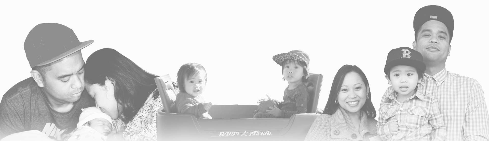
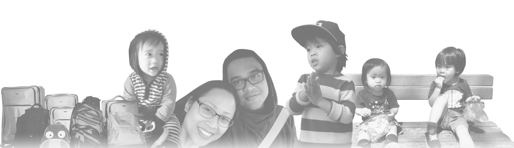
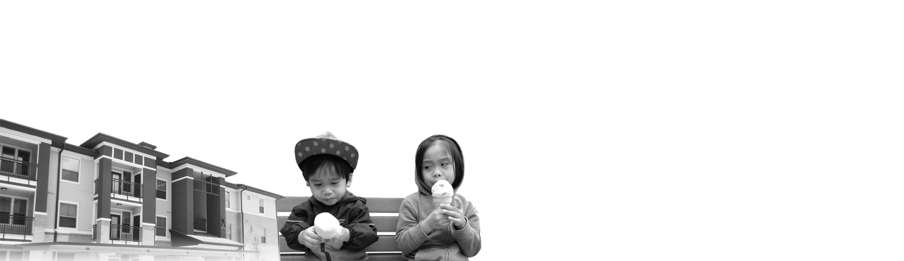

<h1 class="home--subtitle text--bold">we knew our lives  had to change.</h1>

#### Former life

Feels like it was just yesterday that I was a Site Supervisor for a local YMCA in San Diego, California, running a school's before-and-after school program. I worked with thousands of kids, collectively, and I loved being in the position of being able to inspire these students to value their education.

(One problem though.)

The job itself was not sustainable, especially with a growing family. Imagine being a father, a _supposed provider_, and bringing home a humbling $700 check, every two weeks.

It used to hurt - knowing they deserved better than what I brought home. I remember cradling my son when he was just a baby, looking into his eyes and whispering:

_“I have no idea how I'm going to do this, but I promise that we're going to give you the best life you could possibly have.”_

The guilt and fear of not being a 'great father' led me back to school (while still working full-time). Somehow I was able to accelerate through another undergrad program and received a BS in Information Technology within two years. Even then, I didn't know where I would find a decent enough job, espcially since San Diego isn't known for being too much of a tech city.

By the time our second son was born, I was sure of a few things. I knew I wanted a role in the tech industry, which would mean learning a totally new skillset. After long consideration, we had to admit that San Diego didn't have much to offer us.

At that point, we knew our lives had to change.

<!-- 
<figcaption>The first years of familyhood</figcaption> -->

#### Uprooting

Leaving your family and friends behind is something we would've never dreamed of doing. Plus, everything and everyone that our boys knew was _in_ San Diego. But, after learning that I was accepted into a software development camp in Austin, TX, my wife and I made the life-altering decision to take the risk, sacrifice the comforts of being _at home_, and move.

The transition was not easy, it wasn't cheap, and it didn't come without a ton of struggle. For once in our lives, we had no one - no family, no friends, no understanding of the landscape, and no idea how we'd make it work. All we had were each other and the hopes of a better opportunity and future. 

On the morning of March 2nd, 2014, we left the sunny west coast and bid farewell to San Diego.

It was 28 ºF when we landed in Texas.

<!-- 
<figcaption>Relocating to Austin</figcaption> -->

#### New heights

If there's one thing I learned over the past couple of years, it would be this: welcome the risks - even if that ultimately equates to _only the possibility_ of something greater. These possibilities can be life-changing.

Two years later, and I'm happy to report that the initial sacrifices we took have paid off, beautifully. We settled in a new city, I finished school within three months, and landed my first position as (in my dream industry) shortly after. 

<!-- 
<figcaption>Life has been blessed, to say the least</figcaption> -->

#### Fam

Like I've mentioned before, **being a Front-End Developer ain't about me. It's just not. In the work aspect, it's about the team I work with, and how together, we aim to bring value and solve problems for our users.  Then on the other hand, this entire journey is about my family.**

These consecutive years of waking up between 3 - 4am to study, learn, and practice code, (along with happily putting in 10 hour days at work) have all been for my wife and two boys. They are the my purpose, my best friends, and I love that they keep me motivated.

Where we go from here, man, who knows?

What I do know, is that we can look back and reflect on the sacrifices and risks that we took over the past couple of years, and proudly say to ourselves -  *we've made it.*
